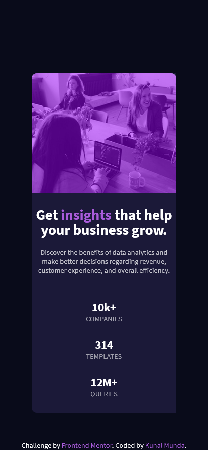
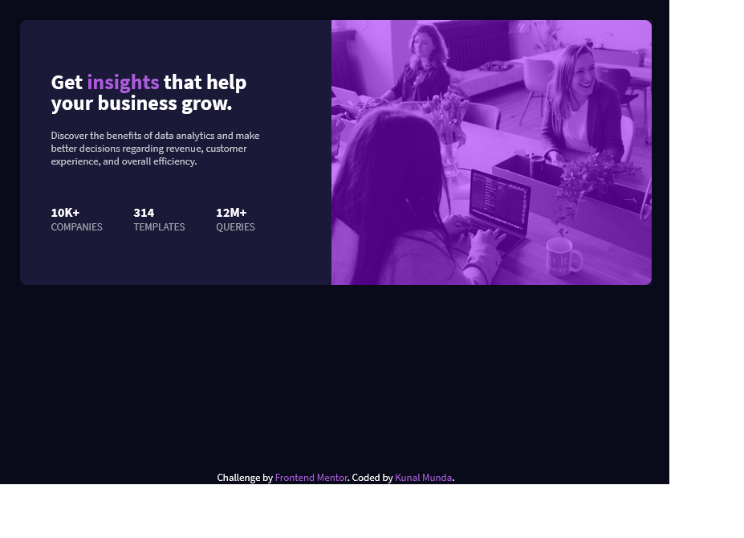

# Frontend Mentor - Stats preview card component solution

This is a solution to the [Stats preview card component challenge on Frontend Mentor](https://www.frontendmentor.io/challenges/stats-preview-card-component-8JqbgoU62). Frontend Mentor challenges help you improve your coding skills by building realistic projects. 

## Table of contents

- [Overview](#overview)
  - [The challenge](#the-challenge)
  - [Screenshot](#screenshot)
  - [Links](#links)
- [My process](#my-process)
  - [Built with](#built-with)
  - [What I learned](#what-i-learned)
  - [Continued development](#continued-development)
  - [Useful resources](#useful-resources)
- [Author](#author)
- [Acknowledgments](#acknowledgments)

## Overview

### The challenge

Users should be able to:

- View the optimal layout depending on their device's screen size

### Screenshot

### Links

- Solution URL: [Add solution URL here](https://your-solution-url.com)
- Live Site URL: [Add live site URL here](https://your-live-site-url.com)

## My process

### Built with

- Semantic HTML5 markup
- CSS custom properties
- Flexbox
- Mobile-first workflow

### What I learned

- First again is I learned how it is very helpful to keep the CSS dry to do a favor for myself.
- Should give more time to learn SCSS as it the most amazing thing I have see till now that is.
- And I advise my future self if you are reading this for any solutions from it is that first check that everything is semantic HTML as it will will help you lessen your stress.

### Continued development

- Will continue to develop the skill to use SCSS fully to its capacity.
- And also Grid is also there what you (that is me) need to learn.

### Useful resources

- [freecodecamp](https://www.freecodecamp.org/) - This helped me for everything basically. I will never be thankful enough to them for there support on every coding language (if not every then 'almost').
- [CSS Tricks](https://css-tricks.com/) - This website is another gold. Want to learn CSS go for this website.

## Author

- Website - [Add your name here](https://www.your-site.com)
- Frontend Mentor - [@ryu-kamiski](https://www.frontendmentor.io/profile/ryu-kamiski)

